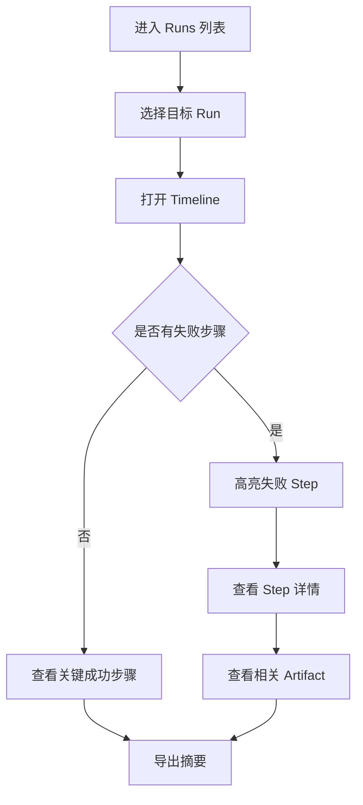
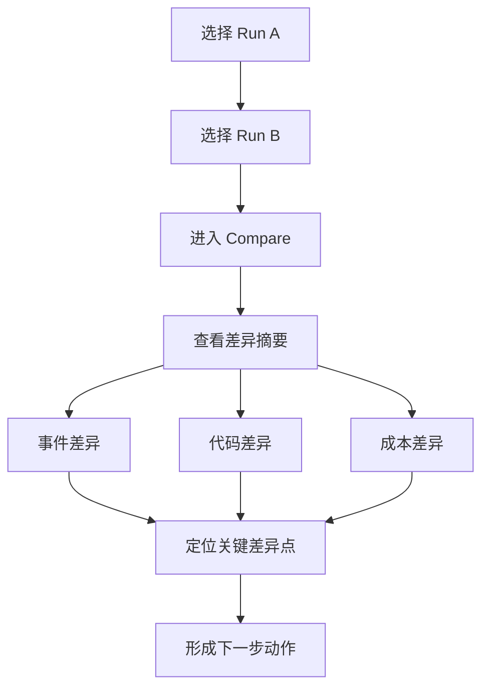
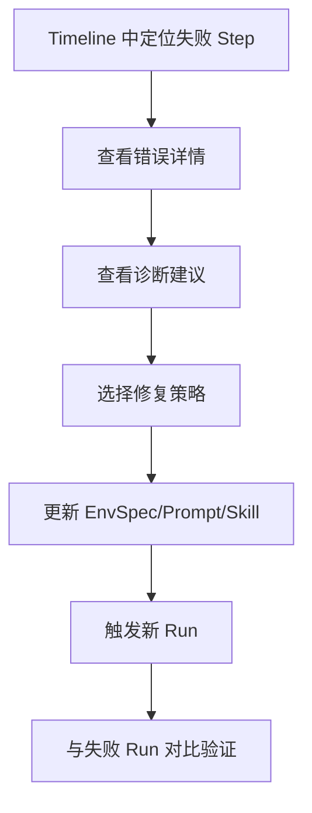

---
stepsCompleted:
  - step-01-init
  - step-02-discovery
  - step-03-core-experience
  - step-04-emotional-response
  - step-05-inspiration
  - step-06-design-system
  - step-07-defining-experience
  - step-08-visual-foundation
  - step-09-design-directions
  - step-10-user-journeys
  - step-11-component-strategy
  - step-12-ux-patterns
  - step-13-responsive-accessibility
  - step-14-complete
inputDocuments:
  - _bmad-output/planning-artifacts/prd.md
  - _bmad-output/planning-artifacts/architecture.md
  - _bmad-output/planning-artifacts/epics.md
workflowType: ux-design
project_name: MultiverseOS
user_name: Njin
date: 2026-03-27
lastStep: 14
status: complete
completedAt: 2026-03-27
---

# UX Design Specification MultiverseOS

**Author:** Njin  
**Date:** 2026-03-27

---

## Executive Summary

### Project Vision

MultiverseOS 的 UX 目标是把“看不见、不可复现的 AI 开发过程”变成“可观察、可比较、可复盘”的实验体验。界面不仅要展示事件，还要帮助用户快速回答三个问题：
1. 这次 run 发生了什么？
2. 它和另一次 run 的关键差异是什么？
3. 下一次我应该改什么（EnvSpec / Prompt / Skill）？

### Target Users

- Harness 工程师：频繁做对比实验与环境调优
- AI 工具开发者：关注 timeline、失败定位、成本归因
- 团队 Tech Lead：关注跨 run 可比性与知识沉淀

### Key Design Challenges

- 时间线与 diff 信息量高，容易认知过载
- run 对比需要“可解释差异”，不是只给原始日志
- 本地优先要求低延迟、无云依赖，但又要高可读性

### Design Opportunities

- 通过“运行叙事卡片 + 差异摘要”降低理解门槛
- 把对比结果与后续动作（复跑、导出、标注）串成闭环
- 用稳定视觉语法（状态色、严重性、事件类型）提高扫描效率

## Core User Experience

### Defining Experience

**定义性体验**：用户在 2-3 分钟内完成“选 run -> 看关键步骤 -> 与另一次 run 对比 -> 得到可执行结论”。

### Platform Strategy

- 桌面 Web 为主（开发者主工作场景）
- CLI 与 UI 相互跳转：CLI 触发动作，UI 承载深入分析

### Effortless Interactions

- 统一主导航：Runs / Timeline / Compare / Diagnostics
- 关键操作一跳可达：从列表直接进入对比
- 时间线默认折叠噪声，仅突出“差异点/失败点”

### Critical Success Moments

- 首次看到完整 run 时间线并能定位失败 step
- 同屏对比 run 差异并得到“变更影响”结论
- 直接复制/导出证据用于 PR 评审

### Experience Principles

- 证据优先：先给可验证事实，再给解释
- 降噪优先：默认展示关键差异而非全部细节
- 可回溯：每个结论都能追溯到事件与工件

## Desired Emotional Response

### Primary Emotional Goals

- 掌控感：知道系统在做什么、为什么这样做
- 确定感：面对回归时有可复盘路径
- 进展感：每次对比都能导向下一步行动

### Emotional Journey Mapping

- 进入 run：从“混乱”到“可读”
- 定位问题：从“猜测”到“证据”
- 制定改进：从“试错”到“实验决策”

### Micro-Emotions

- Step 展开时的“信息安心感”
- Compare 高亮时的“差异洞察感”
- 诊断建议卡片的“可执行感”

### Design Implications

- 信息层级清晰，避免大段日志堆叠
- 失败与风险状态视觉优先级更高
- 每个页面保留“下一步操作”区域

### Emotional Design Principles

- 关键反馈即时
- 错误提示可操作
- 成功状态可被复用（导出、标注、分享）

## UX Pattern Analysis & Inspiration

### Inspiring Products Analysis

- 可观测产品的时间线交互：以事件分层和上下文钻取为核心
- 开发工具控制台：以筛选、固定列、快速复制为核心
- 代码审阅工具：以差异优先、上下文回链为核心

### Transferable UX Patterns

- 双栏对比（baseline vs candidate）
- 事件摘要 + 详情抽屉
- 面包屑导航 + 返回上下文

### Anti-Patterns to Avoid

- 将原始日志直接当主界面内容
- 只显示“失败/成功”而没有可解释路径
- 对比页面不显示差异来源

### Design Inspiration Strategy

采用“结构克制 + 信息高密度 + 差异高亮”的开发者工具风格，不追求装饰性视觉。

## Design System Foundation

### 1.1 Design System Choice

Tailwind CSS 4 + 语义化组件层（Button/Card/Badge/Table/Dialog）+ 设计 token（CSS Variables）。

### Rationale for Selection

- 与现有 UI 技术栈一致
- 便于快速演进与统一样式约束
- 对响应式和可访问性支持成熟

### Implementation Approach

- 定义全局 token：色彩、字号、间距、边框、阴影
- 组件以“语义变体”而非“业务特例”扩展

### Customization Strategy

- 优先扩展 token，不直接散落硬编码颜色
- 高风险视图（Compare/Diagnostics）采用独立语义色阶

## 2. Core User Experience

### 2.1 Defining Experience

用户执行一次对比分析不超过 5 次点击，并始终可回到上一层上下文。

### 2.2 User Mental Model

- Verse = 实验环境
- Run = 一次执行记录
- Step = 执行中的关键动作
- Compare = 两次执行差异

### 2.3 Success Criteria

- 90% 的关键问题可在单页完成定位
- 主要任务（打开对比、查看差异）平均耗时显著下降

### 2.4 Novel UX Patterns

- 差异解释卡（What changed / Why it matters / Next action）
- 事件证据链跳转（summary -> raw event -> artifact）

### 2.5 Experience Mechanics

- 固定顶部上下文条：当前 verse/run/compare 对象
- 关键筛选项置顶：event type、tool、severity、cost

## Visual Design Foundation

### Color System

- `--bg`: #0f172a（深背景）
- `--panel`: #111827
- `--text`: #e5e7eb
- `--muted`: #94a3b8
- `--primary`: #22c55e（成功/推进）
- `--accent`: #38bdf8（信息/导航）
- `--warn`: #f59e0b
- `--danger`: #ef4444

### Typography System

- 标题：`"IBM Plex Sans", "Noto Sans SC", sans-serif`
- 代码与日志：`"JetBrains Mono", "Fira Code", monospace`
- 层级：H1 28, H2 22, H3 18, Body 14-16

### Spacing & Layout Foundation

- 基础间距单位：8px
- 网格：12 列（桌面）、4 列（移动）
- 关键信息卡片垂直节奏：16/24/32

### Accessibility Considerations

- 最低文本对比度满足 WCAG AA
- 所有可交互组件具备 focus ring
- 键盘可达主流程（筛选、展开、切换、导出）

## Design Direction Decision

### Design Directions Explored

- Direction A: 控制台风格（高密度）
- Direction B: 分析仪表盘风格（平衡密度）
- Direction C: 文档工作台风格（低密度）

### Chosen Direction

选择 **Direction B（分析仪表盘）**：在可读性与信息密度之间平衡，适合长时间分析任务。

### Design Rationale

- 比纯控制台风格更易扫读
- 比文档式布局更高效
- 能自然承载对比视图与时间线

### Implementation Approach

- 左侧对象导航 + 主内容分析区 + 右侧详情抽屉
- Compare 页采用固定双栏 + 同步滚动

## User Journey Flows

### 旅程 1：首次观察一次 run

目标：快速理解一次执行发生了什么。

### 旅程 2：对比两次 run

目标：找出变化和影响。

### 旅程 3：诊断失败并复跑

目标：从失败走向可执行修复。

### Journey Patterns

- 先摘要后细节
- 先差异后原文
- 先定位后行动

### Flow Optimization Principles

- 每个页面保留“下一步动作”
- 默认展示高价值信息
- 所有关键视图支持快速复制/导出

## Component Strategy

### Design System Components

- `Button`, `Input`, `Select`, `Tabs`, `Badge`, `Card`, `Dialog`, `Table`, `Tooltip`

### Custom Components

- `RunSummaryCard`
- `StepTimelineItem`
- `DiffInsightPanel`
- `CostBreakdownChart`
- `DiagnosticsSuggestionCard`
- `FilterBar`

### Component Implementation Strategy

- 先交付“数据密集视图组件”（Timeline/Compare）
- 再交付“辅助操作组件”（Export/Label/Notes）

### Implementation Roadmap

1. 核心容器与布局组件  
2. Timeline 组件组  
3. Compare 组件组  
4. Diagnostics 组件组

## UX Consistency Patterns

### Button Hierarchy

- Primary：推进核心动作（Run/Compare/Replay）
- Secondary：辅助动作（Filter/Export）
- Ghost：低干扰动作（展开细节）

### Feedback Patterns

- 成功：绿色状态条 + 可复制结果
- 警告：黄色状态卡 + 建议动作
- 失败：红色状态卡 + 诊断入口

### Form Patterns

- 筛选表单即时应用，可一键重置
- 错误提示贴近输入控件

### Navigation Patterns

- 一级导航固定
- 二级上下文（run id / compare pair）固定显示

### Additional Patterns

- 空状态必须提供下一步建议
- 加载状态使用骨架屏，不阻断主布局

## Responsive Design & Accessibility

### Responsive Strategy

- Desktop-first，兼顾 1280+ 分析场景
- Tablet 保持主流程可用（简化右侧抽屉）
- Mobile 提供只读与轻操作能力

### Breakpoint Strategy

- `sm` 640
- `md` 768
- `lg` 1024
- `xl` 1280
- `2xl` 1536

### Accessibility Strategy

- 关键流程全键盘可达
- 表格与时间线提供语义化标签
- 图表提供文本替代摘要

### Testing Strategy

- 自动化：a11y lint + 对比度检测
- 手工：键盘导航、屏幕阅读器、高缩放测试
- 设备：Chrome/Firefox/Safari/Edge + 常见桌面分辨率

### Implementation Guidelines

- 优先语义 HTML 与 aria-label
- 焦点状态视觉必须统一
- 文案避免“仅颜色传达状态”
- 所有关键交互都要有可观察反馈
