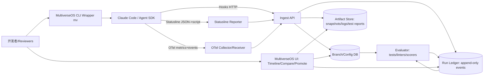

# MultiverseOS：面向 Claude Code Harness 工程的多分支实验操作系统可行性与价值研究

## 执行摘要

本研究聚焦一个“更窄、更可落地”的 MultiverseOS 形态：以 **Claude Code** 为核心运行时，把一次开发任务视为可复现的“实验”，并把 **模型选择、skills/plugins、SDD/工作流框架、subagents、提示词/配置变体、工具调用与代码变更** 全部纳入可追溯的版本与运行账本（run ledger）中，实现 **分支化实验、可视化审阅、从任意步骤分叉、回放/重跑/审计、对比与晋升（promote）**。结论是：**可行且有明显价值**，但必须把产品定位为“Claude Code 能力之上的编排与证据层”，避免与 Claude Code 既有的 **checkpointing、/fork、git worktree、hooks、OpenTelemetry 导出、插件市场** 等功能重复造轮子。citeturn23view1turn24search6turn18search11turn18search4turn21view1

可行性的关键在于：Claude Code 提供了多条官方扩展与可观测入口——**hooks**（生命周期事件触发的确定性脚本/HTTP 调用）、**skills/subagents/plugins/marketplaces**（可打包分发的工作流与专门代理）、**Agent SDK/CLI headless（-p）**（可程序化运行与结构化输出）、**statusline**（通过 stdin 提供会话 JSON：成本、上下文、git/worktree 等）、**OpenTelemetry（OTel）导出**（组织级使用、成本、工具活动指标与事件）。这些入口天然支持“运行账本 + 分支实验 OS”式的外部控制平面。citeturn18search4turn19search0turn22view1turn14view4turn21view1

价值上，针对 Claude Code 的 harness 工程（skills/plugins/subagents/workflow 的组合与迭代），MultiverseOS 主要带来三类收益：  
1) **复现与审阅效率**：把“为什么这次跑出了这个 PR/patch”从口头描述变成可回放的证据链；  
2) **实验并行化**：把“提示词/skill 变体、subagent 组合、模型配置”纳入逻辑分支，和 git worktree/物理分支对齐，并提供跨分支对比；  
3) **成本与治理**：利用 Claude Code 的 cost/token/决策指标与事件（OTel、statusline），在 run 维度做预算、告警与归因。citeturn19search20turn21view4turn20search5turn18search11

但要实现“强回放保证”，必须补齐：**确定性/记录型回放策略、外部状态捕获（workspace/依赖/网络/工具输出）、安全与密钥处理、对 tools 调用语义的规范化、以及把 OTel GenAI + PROV 的语义落到数据模型中**。此外，Claude Code 自带 checkpointing 仅跟踪其文件编辑工具产生的变更，不覆盖 bash 命令造成的文件变更，也不覆盖会话外/并行会话的改动，因此 MultiverseOS 不能把 Claude 的 checkpoint 当作完整可复现实验的唯一基石。citeturn23view1

综合建议：**值得立项**，以 3 个里程碑推进（MVP→V1→V2）。MVP 以“运行账本 + 分支管理 + 对比 + 记录回放（proxy replay）”为主，优先接入 hooks/statusline/OTel；V1 做 workspace 快照与 fork-from-step；V2 做更强的重跑/审计、安全治理与大规模分析。成功/止损标准应以“复现耗时降低、重复跑单成本降低、代码审阅周期缩短、回归降低”来度量，并用 Claude Code OTel 的成本与事件数据做 ROI 归因。citeturn21view1turn21view4turn20search0

## 目标范围与假设

**目标范围（本报告定义）**：围绕“单个开发任务（单个 repo、单个 PR/issue 或单个特性）”，对 Claude Code 的 agentic 开发进行 harness 工程化管理。Harness 在此范围内包含：

- **模型提供方与运行入口**：Claude Code（交互/IDE/CI 形态），以及其可程序化运行的 Agent SDK / CLI `-p` 模式（支持 `--output-format json|stream-json` 等结构化输出）。citeturn18search8turn22view0turn22view1  
- **skills / plugins（含 marketplace）**：用 `SKILL.md`（提示式剧本）扩展能力，可 `/skill-name` 调用；plugins 将 skills、hooks、subagents、MCP servers 打包到可安装单元；marketplace 提供发现、版本跟踪与自动更新等分发能力。citeturn18search2turn19search13turn19search0turn19search4  
- **SDD / 工作流框架**：例如 Spec Kit（偏 specification-driven 开发脚手架）与 LangGraph（偏 agent workflow 编排）；在本产品中被视为“可插拔 workflow/harness 适配器”。citeturn2search6turn0search2  
- **subagents 与编排**：subagents 以独立 context window 运行，具备自定义系统提示、工具权限与可选模型，用于隔离探索与实现、约束工具、控制成本。citeturn19search7turn7view2  
- **提示词/配置变体**：包括系统提示替换（`--system-prompt`/文件）、输出样式、workload/effort、fast mode、allowed/disallowed tools、权限模式、MCP 配置等。citeturn19search22turn24search7turn19search15turn18search15  

**显式假设（用于工程估算与边界）**：

| 维度 | 假设（可调整） | 对设计的影响 |
|---|---|---|
| 团队规模 | 6–15 名开发者，其中 2–4 名“harness 工程师”维护技能/插件/工作流 | 需要共享的 run ledger、审阅 UI、RBAC |
| 部署模型 | 默认 **本地优先**（开发者机器/开发容器）+ 可选 **团队级服务**（内网） | 事件/工件（artifacts）存储需支持离线与同步 |
| 安全模型 | 代码与密钥默认不出网；如需集中化，走内网 OTel/存储并做脱敏 | 必须有 secrets 红线与脱敏策略；支持企业“托管设置/策略” |
| 规模 | 500–2,000 runs/周；每 run 200–2,000 events；artifact 10–200MB/run（快照+日志） | 需要“热存（事件）+冷存（快照/日志）”分层，检索要快 |
| 多提供商 | 以 Anthropic/Claude 为主，但允许 Bedrock/Vertex/Foundry 等部署形态 | 需要 provider 元数据抽象；OTel `gen_ai.provider.name` 对齐 citeturn19search6turn25search28 |

## Claude Code Harness 痛点与 MultiverseOS 特性映射

本节以 Claude Code 的现实能力为基线：Claude Code 已提供 **会话分叉（/fork、`--fork-session`）、checkpointing（/rewind）、git worktree 工具（EnterWorktree）、插件市场、hooks、statusline、OTel 导出**。因此 MultiverseOS 的价值不在“再造这些功能”，而在把它们统一到一个 **可对比、可回放、可审阅、可治理** 的实验 OS 语义之上。citeturn24search6turn23view1turn18search11turn19search0turn18search4turn19search20turn21view1

下面给出“痛点→特性→量化收益（估计）→集成要求→局限”的映射。量化为**粗估**，用于商业与工程决策；实际值需用你们团队的基线数据校准（建议在 MVP 试点阶段 A/B）。  

| Claude harness 痛点 | 现象（Claude Code 场景） | MultiverseOS 特性如何解决 | 预期量化收益（粗估） | 需要的集成/元数据 | 主要局限 |
|---|---|---|---|---|---|
| 可复现性差 | 插件/skill 变体、模型配置、上下文来源（CLAUDE.md、自动记忆、MCP）不易完整复刻；同样 prompt 多次运行结果不同 | Run ledger 记录“配置+输入+工具调用+代码状态”；逻辑分支冻结 harness 配方；回放模式“代理输出/工具输出” | 复现时间从 30–90 分钟 → 5–15 分钟（节省 70–90%） | 采集：hooks（UserPromptSubmit/PreToolUse/PostToolUse等）+ statusline JSON +（可选）OTel events；记录模型/插件版本与 git SHA | 模型本身非确定；“重跑”只能保证环境一致，不保证生成一致；需区分 replay vs rerun |
| 分支化实验困难 | 已有会话 fork 或 git 分支，但“提示词/skill/subagent 组合”与“代码分支”经常不同步；对比成本高 | **逻辑分支 vs 物理分支**：逻辑分支=实验配方（模型+skills+workflow+policy），物理分支=git branch/worktree；支持从任意 Step 分叉生成新逻辑分支并绑定新 worktree | 并行实验吞吐提升 1.5–3×（减少手工切换与重复搭建） | 需要 worktree adapter（EnterWorktree/WorktreeCreate hook）与 branch map；CLI `--plugin-dir`/marketplace pin | Claude Code 自带 session fork 不继承会话级权限，需要重新授权；需要 UI 明确提示 citeturn24search4turn24search7 |
| 可观测性不足（审阅难） | 审阅者看 PR diff，但不清楚 Claude 的工具调用顺序、失败点、为何改这些文件 | 可视化 timeline：Prompt→模型→工具→文件 edit→测试→总结；对比两次 run 的事件与 diff；把 run 作为 PR “证据附件” | PR 审阅轮次减少 10–30%；“问答式”补充信息时间减少 30–60% | 事件模型需覆盖 tool_call、file_edit、test_result、cost；可接入 Claude OTel prompt.id 相关性 | 过度记录会暴露提示/代码；必须提供脱敏与访问控制 |
| 插件/skill 版本漂移 | marketplace 自动更新与本地插件缓存导致“昨天能跑、今天跑不出” | 逻辑分支中声明 plugin source+版本；支持“seed/pin”策略与哈希校验；记录每次 run 的插件清单与版本 | 回归定位时间减少 20–50% | 读取 plugin.json version 及 marketplace 源；必要时镜像仓库；记录 plugin-dir 路径 | 需要规范 plugin 的版本管理；若作者不 bump version，更新可能被缓存跳过 citeturn6view4 |
| subagent 编排不可审计 | subagent 在独立 context window 工作，但主会话只见摘要；问题定位困难 | Run ledger 将 subagent 视为“子 run/子 trace”，保留关键步骤与工具调用；支持按 subagent 维度对比与预算 | 定位 subagent 误用工具/偏航时间减少 30–60% | 需要 subagent 元数据（name/model/tools/permissionMode 等）；并对齐 OTel GenAI agent spans | plugin 内的 subagents 出于安全会忽略 hooks/mcpServers/permissionMode 等字段，限制可配置性 citeturn7view2 |
| Debugging 与回滚不完整 | Claude checkpointing 只跟踪文件编辑工具，不跟踪 bash 造成的变更，也不覆盖会话外改动 | fork-from-step 以 git worktree+patch 快照实现；回放/重跑区分“回放保证等级”；记录外部副作用（网络/命令） | “误改后恢复”时间减少 50–80% | 需要 workspace snapshot（git commit/patch + 非 git 文件）；以及 tool-call 语义（哪些可重放） | 对外部系统写入（网络、数据库）无法安全回放，需要 mock 或禁止 |
| 成本控制弱 | 不清楚一次 run 的 token/成本、哪个 subagent 最烧钱、重复跑单浪费 | 按 run/step 汇总成本、token、耗时；预算上限与告警；重放（proxy replay）减少重复调用 | 迭代期 token 成本减少 20–60%（取决于复跑比例） | statusline JSON（cost、token、cache read/create 等）与 OTel `claude_code.cost.usage`/`token.usage` | 需要把“缓存命中/未命中”与“重跑目的”纳入归因，否则指标误读 citeturn14view4turn21view4 |
| 安全与权限一致性 | 需要统一限制 Edit/Write/Bash/MCP；并防止运行中更改设置绕过策略 | hooks 提供确定性强制（PreToolUse/PermissionRequest 可 allow/deny/ask）；MultiverseOS 作为策略源与审计系统；支持托管设置分发 | 安全事件下降（难量化）；合规审计从“不可得”→“可查询” | 需要 hooks 决策控制回传、ConfigChange 审计、以及 secrets 红线；可结合 sandboxing | 必须处理“提示注入/语义回滚”类新型风险，需要“回放或分叉”语义与记录副作用 citeturn18search4turn20search5turn19search3turn11search21 |

**关于“逻辑分支 vs 物理分支”的产品定义**：  
- **物理分支（Physical Branch）**：git branch/worktree（Claude Code 支持 EnterWorktree 工具与并行 worktree 场景；内置 /batch 也会在隔离 worktree 中启动后台代理）。citeturn18search11turn18search2  
- **逻辑分支（Logical Branch）**：一次实验“配方”的版本（模型/effort/fast、skills/plugins/subagents、SDD/workflow、工具白名单与权限模式、MCP 连接器、系统提示/输出样式等）。Claude Code 本身也有“会话分叉”（/fork 或 `--fork-session`），但它主要是对话历史分叉；MultiverseOS 应把“对话分叉”纳入逻辑分支事件，并显式关联到物理 worktree/commit。citeturn24search6turn24search7turn24search4

## Claude Code 定制化技术架构与数据模型

### 架构概览

MultiverseOS（Claude Focus 版）建议采用“**三路采集 + 一套账本**”：

- **hooks 采集（强推荐）**：Claude Code hooks 在生命周期节点触发，且强调“确定性控制”，适合做审计与策略强制，并天然可把事件推送到 MultiverseOS。citeturn18search4turn8view0  
- **statusline 采集（强推荐）**：状态行脚本通过 stdin 接收会话 JSON，可获得成本、token、git/worktree、transcript_path 等关键字段；脚本可同时把这些数据上报。citeturn19search20turn14view4  
- **OpenTelemetry 采集（团队/企业强推荐）**：Claude Code 可配置 OTel exporter 导出 metrics 与 logs/events，并提供标准属性（session.id、user/organization 等）与 prompt.id 事件关联。citeturn21view1turn21view3turn21view4  

用这三路，MultiverseOS 不必依赖对 transcript.jsonl 的脆弱解析；如需深度内容（prompt/response、工具结果全文），可在“受控环境”启用 transcript 作为 artifact 归档（带脱敏/ACL）。同时应认可社区反馈：对 transcript 的依赖可能脆弱，最好以稳定的 OTel/hook 合约为主。citeturn13search19

下面是建议架构图（Mermaid）：



### 数据模型（面向 Claude Code 的最小闭环）

为满足“分支实验 + 回放/对比 + 审计”的需求，建议最小实体集为：`LogicalBranch`、`Run`、`Step`、`Event`、`Artifact`。它们既能映射到 OTel（事件/指标/可选 span），也能映射到 PROV（实体/活动/代理），便于标准化与互操作。citeturn25search1turn26search0

**LogicalBranch（逻辑分支）**：固化实验配方。关键字段：模型配置（含 fast/effort）、skills/plugins/subagents 清单及 hash、权限策略、workflow 适配器配置、基础分支（parent）等。Claude Code 支持通过 `--plugin-dir` 在单次会话从指定目录加载插件，这对“分支化插件版本”非常关键。citeturn22view3turn19search0

**Run（一次执行）**：绑定到某逻辑分支，并指向某物理代码状态（repo、commit、worktree）。Claude Code 本身支持会话恢复与分叉（`--resume/--continue/--fork-session`），MultiverseOS 应把 claude session id 作为“外部相关 ID”保存。citeturn24search7turn22view2

**Step（步骤）**：对齐用户提示、模型调用、工具调用、文件编辑、测试等。一条用户 prompt 可能触发多个 API 调用与工具执行；Claude Code 的 OTel 事件使用 `prompt.id` 把这些关联起来，这能直接作为 Step 的“相关性键”。citeturn21view4

**Event（事件）**：append-only，允许既接入 Claude hooks 的事件，也接入 Claude OTel logs/events。建议统一为“时间戳 + 类型 + attrs(JSON) + 可选 payload(blob ref)”的结构。

**Artifact（工件）**：workspace 快照、diff、transcript、测试报告、policy 决策记录等。工件是实现“强回放”的关键。

下面给出 JSON 示例（示例字段命名供参考；实际可用 OpenAPI/JSON Schema 固化）：

```json
{
  "LogicalBranch": {
    "id": "lb_01H...",
    "name": "sonnet46+speckit+reviewer_v3",
    "parent_id": "lb_01G...",
    "created_at": "2026-03-25T10:00:00+09:00",
    "config": {
      "claude_code": {
        "model": "claude-sonnet-4-6",
        "fast_mode": false,
        "effort": "high",
        "output_style": "Explanatory",
        "permission_mode": "ask"
      },
      "plugins": [
        {"source": "marketplace", "marketplace": "claude-code-marketplace", "name": "code-review", "version": "1.2.3", "hash": "sha256:..."}
      ],
      "skills": [
        {"name": "deploy", "path": ".claude/skills/deploy/SKILL.md", "hash": "sha256:..."}
      ],
      "subagents": [
        {"name": "code-reviewer", "model": "claude-haiku", "tools": ["Read","Grep"], "hash": "sha256:..."}
      ],
      "workflow": {"type": "spec-kit", "version": "x.y.z", "params": {"spec_dir": "spec/"}}
    }
  }
}
```

```json
{
  "Run": {
    "id": "run_01H...",
    "logical_branch_id": "lb_01H...",
    "repo": {"remote": "origin", "commit_sha": "abc123...", "dirty": true},
    "workspace": {"type": "git_worktree", "path": "/path/to/worktree", "base_branch": "main"},
    "claude": {"session_id": "550e8400-e29b-41d4-a716-446655440000"},
    "budget": {"usd_limit": 5.00, "token_limit": 200000},
    "status": "running",
    "started_at": "2026-03-25T10:03:00+09:00"
  }
}
```

```json
{
  "Step": {
    "id": "step_00012",
    "run_id": "run_01H...",
    "seq": 12,
    "kind": "tool_call",
    "correlation": {"prompt_id": "uuid-v4-from-otel", "tool_use_id": "toolu_..."},
    "timing": {"ts_start": "2026-03-25T10:05:12+09:00", "ts_end": "2026-03-25T10:05:13+09:00"},
    "summary": "Edit src/auth.py",
    "artifact_refs": ["art_diff_..."]
  }
}
```

```json
{
  "Event": {
    "id": "evt_01H...",
    "run_id": "run_01H...",
    "ts": "2026-03-25T10:05:12+09:00",
    "source": "claude_hook",
    "type": "PostToolUse",
    "attrs": {
      "tool_name": "Edit",
      "transcript_path": "/Users/.../transcript.jsonl",
      "cwd": "/repo",
      "session_id": "..."
    },
    "payload_ref": "obj://events/evt_01H....json"
  }
}
```

```json
{
  "Artifact": {
    "id": "art_ws_snapshot_01H...",
    "run_id": "run_01H...",
    "type": "workspace_snapshot",
    "uri": "s3://multiverseos/artifacts/run_01H.../snap.tar.zst",
    "hash": "sha256:...",
    "created_at": "2026-03-25T10:06:00+09:00",
    "meta": {"git_commit": "abc123...", "includes_untracked": true}
  }
}
```

### API 端点（关键动作最小集）

- 创建逻辑分支（冻结配方）
- 启动 run（创建 worktree/设置 claude 会话参数）
- 摄取事件（hooks/statusline/OTel）
- 回放（proxy/recorded/audit）
- 从步骤分叉（fork-from-step）
- 对比（run vs run / branch vs branch）
- 晋升（promote：把某逻辑分支/某 run 的产物合并到目标分支并生成 PR 工作流）

示例（仅展示关键 payload）：

```json
POST /v1/branches
{
  "name": "sonnet46+speckit+reviewer_v3",
  "parent_id": "lb_base",
  "config": { "...": "..." }
}
```

```json
POST /v1/runs
{
  "logical_branch_id": "lb_01H...",
  "repo_path": "/repo",
  "workspace": {"strategy": "new_worktree", "base_branch": "main"},
  "claude": {"mode": "sdk_cli", "args": ["-p", "Fix the login bug", "--output-format", "stream-json"]},
  "budget": {"usd_limit": 5, "token_limit": 200000}
}
```

```json
POST /v1/runs/run_01H.../events
{
  "source": "claude_hook",
  "type": "PreToolUse",
  "ts": "2026-03-25T10:05:12+09:00",
  "attrs": {"tool_name": "Bash", "cwd": "/repo", "session_id": "..."},
  "payload": {"command": "pytest -q"}
}
```

```json
POST /v1/runs/run_01H.../fork
{
  "from_step_id": "step_00012",
  "new_branch_name": "try_alt_fix",
  "fork_mode": "workspace_patch",
  "replay_mode": "proxy"
}
```

```json
POST /v1/runs/run_01H.../replay
{
  "mode": "proxy", 
  "include": ["timeline","diffs","tests"],
  "ui_hint": {"guarantee_level": "recorded_outputs_only"}
}
```

### 最小适配器清单（Claude Focus）

1) **Claude Provider Adapter**：  
负责从 Agent SDK/CLI `-p` 的 `--output-format json|stream-json` 收集结构化输出、会话 ID、使用情况等；并记录请求元数据（例如 API `request-id`、usage token）。Claude API 响应含 `request-id` 头与 `usage` 字段（输入/输出 tokens），可作为审计锚点。citeturn22view1turn13search0

2) **Skill/Plugin Adapter**：  
解析 `.claude/skills/` 与启用的 plugins 列表，提取版本与 hash；对 marketplace 来源记录“市场+插件名+版本”。Marketplaces 被定义为“目录”，并明确提供版本跟踪与自动更新；plugins 可通过 skills/subagents/hooks/MCP servers 扩展 Claude Code。citeturn19search0turn19search4turn19search13turn19search2

3) **Sandbox/Worktree Adapter**：  
为每次 run 创建隔离 worktree（或进入已有 worktree），并记录路径/分支/基底；必要时利用 WorktreeCreate hook（Claude Code hooks 参考中包含 WorktreeCreate/WorktreeRemove 事件与可替换默认 git 行为的机制）。citeturn18search11turn8view3turn17search21  
同时对安全场景，应支持 Claude Code 原生 sandboxing（bash 工具的文件系统与网络隔离）并将“sandbox 配置与逃生舱口”写入 run metadata。citeturn19search3turn19search9

4) **Workflow Adapter（LangGraph / Spec Kit / Superpowers）**：  
把框架内部的节点/任务/计划，映射为 Step/Event；并把框架的“版本+配置+模板输入”写进 LogicalBranch。LangGraph 属于图式 workflow 编排；Spec Kit 属于规范驱动脚手架；二者作为“上层 harness”，都需要被纳入同一 run ledger 以比较不同方案。citeturn0search2turn2search6

## 回放策略与可观测性对齐

### 回放模式设计（确定性、记录型、审计型）

由于 LLM 生成具有非确定性，且 Claude Code 的执行涉及外部工具与环境状态，MultiverseOS 必须在产品层面提供 **“回放保证等级（Replay Guarantee Level）”**，并在 UI 明确标注，避免把“重跑”误当“确定性复现”。

建议至少提供三种模式：

- **Recorded / Proxy Replay（记录回放，强保证）**：不调用模型、不执行工具；只按 ledger 重放已记录的模型输出与工具结果。适用于审阅、复盘、合规取证。  
- **Deterministic Tool Replay（工具确定性回放，中等保证）**：在固定 workspace snapshot 上重放“只读/可确定”工具（Read/Grep/Glob 等），对 Bash/网络类工具默认禁用或走 mock；模型输出可以 proxy，也可以选择重跑（见下一项）。Claude Code tools 列表明确区分诸多文件与任务工具（Read/Edit/Bash/EnterWorktree 等），可建立“可重放白名单”。citeturn18search11turn8view1  
- **Audit Rerun（审计重跑，弱保证）**：在固定配置/依赖/代码状态下重新调用模型与工具，用于“回归检测与鲁棒性评估”；结果可能不同，但可以比较差异并量化漂移。

### 为 Claude Code “可回放”需要记录什么

最低记录集应覆盖四层：模型层、工具层、工作区层、治理层。

**模型层**：  
- 模型 ID/别名、fast mode、effort/workload、系统提示/输出样式、工具许可（allowed/disallowed tools）。Claude Code 支持 output styles（修改系统提示）、fast mode（速度与成本权衡）与 effort level（工作量级别）；这些都必须进入 LogicalBranch。citeturn19search22turn19search15turn24search7  
- API 元数据：Anthropic/Claude API 返回 `request-id`（响应头）与 token usage（`input_tokens`/`output_tokens`），适合作为审计字段。citeturn13search0  

**工具层**：  
- 每次工具调用的 `tool_name`、输入、输出、决策（允许/拒绝）、错误信息；以及 transcript_path/会话 id 等上下文。Claude Code hooks 在工具事件中提供 `transcript_path`，并能通过 PreToolUse/PermissionRequest 等做“允许/拒绝/询问”决策控制；并支持 HTTP hooks（含严格的 env var 插值白名单 `allowedEnvVars`），这使“事件采集+策略执行+密钥约束”成为可能。citeturn8view1turn8view2turn8view0  
- MCP 工具调用需记录 server/tool；Claude Code hooks 中 MCP 工具使用 `mcp__<server>__<tool>` 命名模式，可用于匹配与审计；同时 OTel 也给出了 MCP 的语义约定。citeturn19search14turn25search19  

**工作区层**：  
- git commit + worktree 路径 + dirty 状态 + patch；以及非 git 文件（生成物/缓存）是否纳入快照。  
- 必须补齐 Claude checkpointing 的缺口：checkpointing 只跟踪文件编辑工具的改动，不跟踪 bash 命令导致的文件变化，也不跟踪会话外/并发会话变更；因此 MultiverseOS 的 workspace snapshot 需要覆盖这些。citeturn23view1  

**治理层（权限与安全）**：  
- 权限模式、hook 决策链、设置变化（ConfigChange）审计记录。Claude Code 安全建议明确提到：用 OpenTelemetry metrics 监控使用情况，并用 ConfigChange hooks 审计/阻止会话期间设置更改；MultiverseOS 可直接承接为“中央策略源”。citeturn20search5  
- secrets：只记录“引用/哈希/标签”，避免明文入账本；对外部服务调用要能在回放中 mock。

### 防止“语义回滚攻击”与回放语义

近期研究表明，若对 agent 的 checkpoint/restore 处理不当，可能出现“语义回滚攻击”（通过恢复与重新生成导致工具副作用失配、或绕过原有约束）。一种关键缓解思路是将恢复语义明确化：**要么严格 replay 原轨迹（包括工具效果），要么在恢复点 fork 成新分支并重新执行，且显式标记为新轨迹**。citeturn11search21  
这与 MultiverseOS 的“fork-from-step + replay mode 标签”高度一致：UI 必须显示回放保证等级，并在审计模式下锁定不可重放工具。

### 可观测性对齐：OpenTelemetry GenAI + Claude Code OTel + PROV

**Claude Code OTel 基线**：  
- Claude Code 可通过环境变量启用 OTel：`CLAUDE_CODE_ENABLE_TELEMETRY=1`，并配置 metrics/logs exporter 与 OTLP endpoint；并提供标准属性（session.id、organization/user 等）与事件关联属性 `prompt.id`，支持把单次用户提示触发的多次 API 调用与工具结果串起来。citeturn21view1turn21view3turn21view4turn20search8

**OpenTelemetry GenAI 语义约定（对齐目标）**：  
- OTel 已在 `gen_ai.*` 命名空间下定义生成式 AI 的 attributes，并区分 events、metrics、model spans、agent spans 等信号；目前这些语义约定仍处于 Development/演进中，并提供“稳定性 opt-in”机制。citeturn25search1turn25search6turn25search3  
- GenAI spans 命名建议为 `{gen_ai.operation.name} {gen_ai.request.model}`；并强调用 `gen_ai.provider.name` 作为不同提供方语义风格的判别器。citeturn25search2turn25search28  

**PROV 对齐（证据链/来源追踪）**：  
- PROV-DM 将 provenance 形式化为 entities、activities、agents 的关系图，用于评估数据/产物的质量、可靠性与可信度；PROV-O 则提供 OWL2 本体表示。citeturn26search0turn26search1  
在 MultiverseOS 中可做如下映射：  
- `Artifact` ≈ PROV Entity（如 workspace snapshot、test report、diff）  
- `Step`/`Run` ≈ PROV Activity（产生/使用 artifacts）  
- 用户/主 agent/subagent ≈ PROV Agent  
- `used`/`wasGeneratedBy`/`wasAssociatedWith` 等关系用于把“谁在什么配置下做了什么工具调用，产生了哪些代码变更”标准化表达。

**示例：OTLP/JSON 风格事件（用于导出或内部统一）**

```json
{
  "time_unix_nano": 1774400712000000000,
  "severity_text": "INFO",
  "body": {
    "event": "tool_call",
    "message": "Edit src/auth.py"
  },
  "attributes": {
    "service.name": "multiverseos",
    "run.id": "run_01H...",
    "logical_branch.id": "lb_01H...",
    "prompt.id": "2f6c1c4a-....",
    "gen_ai.provider.name": "anthropic",
    "gen_ai.operation.name": "chat",
    "gen_ai.request.model": "claude-sonnet-4-6",
    "gen_ai.usage.input_tokens": 1200,
    "gen_ai.usage.output_tokens": 340,
    "gen_ai.tool.name": "Edit",
    "code.repo.commit": "abc123...",
    "code.file.path": "src/auth.py"
  }
}
```

上述字段选择原则是：  
- 用 `prompt.id` 复用 Claude Code OTel 的“单提示关联键”；citeturn21view4  
- 用 `gen_ai.*` 对齐 OTel GenAI 生态（即便 Claude Code 当前导出的是 `claude_code.*` 指标/事件，MultiverseOS 也可做二次映射或双写）；citeturn25search1turn25search13  
- 用 PROV 概念为 artifacts/steps 建立“可证明的因果链”。citeturn26search0  

## 实施路线图、投入产出与 Go/No-Go

### 路线图与人月估算

下述工程量以“熟悉 Claude Code hooks/OTel/插件体系的 3–5 人小队”为基线，按人月估算（不含长期运维）。

**MVP（目标：可用的 run ledger + 分支 + 对比 + 记录回放）**  
- 交付内容：  
  - LogicalBranch/Run/Step/Event/Artifact 最小模型 + 存储  
  - hooks/statusline 摄取（HTTP Ingest）  
  - 基础 UI：Timeline、Diff（git diff + 事件差异）、Run 对比  
  - 回放：proxy replay（只回放记录）  
  - CLI wrapper：一键创建 worktree、启动 claude `-p --output-format stream-json`、注入配置  
- 预计工程量：**8–12 人月**（2–3 个月，3–4 人）  
- 关键风险与缓解：  
  - 事件 schema 漂移：优先依赖官方 hooks/OTel 合约，避免深度耦合 transcript 解析；citeturn18search4turn21view1  
  - 隐私：默认不上传 prompt/response 全文，只上传摘要+哈希；全文作为可选 artifact 加密存储。

**V1（目标：fork-from-step + workspace 快照 + 自动评测）**  
- 交付内容：  
  - workspace snapshot（git commit/patch + 非 git 文件策略）  
  - fork-from-step：从指定 step 生成新 worktree 并回放到该点  
  - 评测：测试/静态检查/安全扫描结果作为 Step（与工作流适配器集成）  
  - 与 Claude Code OTel 事件/指标对齐展示（成本、token、工具决策）  
- 预计工程量：**15–22 人月**（3–4 个月，4–6 人）  
- 关键风险与缓解：  
  - bash/外部副作用难回放：默认把 Bash/网络类工具标为“不可重放”，fork 时强制新分支并显式提示；citeturn23view1turn11search21  
  - 插件版本漂移：建立“企业镜像 marketplace / 强制版本号策略”，并在逻辑分支中写死。citeturn19search0turn6view4  

**V2（目标：审计级重跑、策略治理、规模化分析）**  
- 交付内容：  
  - audit rerun：固定环境（devcontainer/OCI image digest）、依赖锁（lockfile）、网络策略  
  - secrets 管理（Vault/KMS）、字段级脱敏与 RBAC  
  - 组织/项目级托管设置对接（把策略下发与 run ledger 联动）  
  - 多维分析：按团队/成本中心、按模型/插件、按 subagent 的效率与成本归因  
- 预计工程量：**30–45 人月**（6–9 个月，5–7 人）  
- 关键风险：企业安全评审、合规要求、跨平台开发环境一致性。

### 成功指标与 Go/No-Go 标准（建议）

**核心成功指标（MVP 试点即可测）**：  
- 复现耗时：P50/P90 “从报告到可复现”的时间下降 ≥50%  
- 审阅效率：PR 平均 review 轮次下降 ≥15%，或 review 周期下降 ≥10%（以基线对比）  
- 成本效率：同类任务“重复跑单”次数下降 ≥30%，或 token/成本下降 ≥20%（按 run 归因）  
- 使用渗透：≥60% 的 Claude-assisted PR 附带可点击的 run timeline 链接

Claude Code 的 OTel 能导出 cost/token/会话/工具活动等指标与事件，适合做这些指标的自动化度量与 ROI 归因。citeturn20search0turn21view4

**Go/No-Go（MVP 后 6–8 周）**：  
- 若试点团队无法把复现耗时压到“<15 分钟可定位”的量级，或 run ledger 的采集稳定性 <95%（丢事件/错关联），应暂停扩展，优先加固采集与 schema。  
- 若隐私/安全审查要求导致“不能存任何 prompt/代码 diff”，则需调整产品形态为“仅存元数据 + 本地自持 artifacts”，否则中心化价值会显著下降。

### 粗略商业价值估算（基于假设）

假设：团队 10 人；每周 15 个与 Claude 相关的 PR；每个 PR 因“缺少可复现上下文”额外产生 30 分钟沟通/复跑；再假设 MultiverseOS 让这部分下降 50%。  
- 每周节省：15 PR × 0.5 小时 × 50% = **3.75 小时/周**（团队）  
- 若进一步把“重复跑单”减少 30%，并把部分回放改为 proxy replay，则 token 成本的节省比例与复跑比例正相关（在迭代密集的 harness 工程阶段通常更显著）。成本字段与 token 字段可直接从 statusline/OTel 采集做真实 ROI 计算。citeturn19search20turn21view4

以上估算偏保守：在 plugins/skills/subagents 快速迭代、多人并行试错的阶段，复现与对比的摩擦更高，MultiverseOS 的边际收益更大。

## 对标分析与结论建议

### 与现有工具/方法的重叠与缺口

下表以“Claude-focused MultiverseOS”作为目标形态，比较 Claude Code 原生能力与几类常见生态工具（按你提出的清单）。表格中“✅/🟡/❌”分别表示：已具备/部分具备或需大量定制/缺失。

| 工具/方法 | 多分支实验（逻辑+物理） | 运行账本（step级） | 回放（recorded/proxy） | fork-from-step（workspace级） | 评测/对比（含成本） | 与 Claude skills/plugins 深度耦合 | 证据链标准化（OTel GenAI + PROV） |
|---|---:|---:|---:|---:|---:|---:|---:|
| Claude Code 原生（skills/plugins/hooks/OTel/checkpointing/fork） | 🟡（会话 fork + worktree；但不统一管理“配方”与对比）citeturn24search6turn18search11 | 🟡（OTel/日志存在，但缺少产品化 ledger UI）citeturn21view4 | 🟡（checkpointing 可回溯，但非完整回放；不覆盖 bash）citeturn23view1 | 🟡（checkpointing + git 工具可拼装，但无“一键从步骤分叉”） | ✅（OTel metrics/events、statusline 提供成本/令牌/决策）citeturn21view4turn19search20 | ✅（原生体系）citeturn19search13 | 🟡（可导出 OTel，但不一定是 gen_ai.*；无 PROV 语义）citeturn21view1turn25search1turn26search0 |
| LangGraph（workflow/agent graph） | 🟡（偏 workflow 分支，不等价于 git/worktree）citeturn0search2 | 🟡（可记录节点级状态，但需自建日志与 UI） | 🟡（可做可重放编排，但与代码 workspace 要自建） | ❌（不管理 repo/worktree） | 🟡（评测需外接） | ❌ | 🟡（可做 OTel，但需自建对齐） |
| Spec Kit（SDD/脚手架） | ❌（不解决 run/branch）citeturn2search6 | ❌ | ❌ | ❌ | 🟡（可配测试，但无账本） | ❌ | ❌ |
| Superpowers（工作流/agent 工具，视具体实现） | 🟡 | 🟡 | 🟡 | ❌ | 🟡 | 🟡 | 🟡 |
| Agenta（提示/评测/实验管理） | 🟡（偏提示实验，不天然绑定 git/worktree）citeturn3search0 | ✅/🟡（通常有 run/trace 概念）citeturn3search0 | 🟡（更多是追踪，不一定是可保证回放） | ❌ | ✅/🟡（评测强项）citeturn3search0 | ❌（非 Claude Code 原生体系） | 🟡（可接 OTel/自定义） |
| AgentGit（研究：git-like rollback/branching for agents） | ✅（强调分支/回滚语义）citeturn11search0 | ✅（轨迹管理）citeturn11search0 | 🟡（看实现，通常偏 workflow 重算优化） | 🟡（偏 agent 状态，不必然是 repo/worktree） | 🟡 | ❌ | 🟡 |
| Langfuse（LLM observability + OTel） | ❌（不管分支/worktree）citeturn25search26 | ✅（trace/log 强）citeturn25search26 | 🟡（可重放需产品功能支持） | ❌ | ✅（追踪/评测/指标）citeturn25search26 | ❌ | ✅/🟡（支持 OTel GenAI 映射，但规范仍演进）citeturn25search26turn25search1 |

对比的核心结论是：**现有工具要么偏“workflow 编排/提示管理/可观测”，要么偏“代码版本控制”，缺少一个把 Claude Code 的 plugins/skills/subagents/工具调用 与 git/worktree、回放与审阅证据链统一起来的产品层**。Claude Code 自带很多基础设施，但更像“强运行时”，而 MultiverseOS 是其“实验 OS 与审阅证据层”。citeturn19search13turn21view4turn23view1

### 研究启示：学术趋势与产品机会

SWE-Adept 明确把“Git-based version control + step-indexed checkpoints + 分支探索与失败回退”作为仓库级 SWE agent 可靠性的关键设计之一，并在 SWE-Bench Lite/Pro 上报告最高 4.7% 的端到端解决率提升。其思想与 MultiverseOS 的“从步骤分叉/回放/对比”高度同构，说明这不是“好看但没用”的工程洁癖，而是提升 agent SWE 可靠性的一条主流路径。citeturn27search0

此外，OpenTelemetry GenAI 正在将模型/代理/工具使用的语义约定标准化（gen_ai.*），并提供 Anthropic/AWS/OpenAI 等 provider 的扩展约定与 MCP 相关语义，这为 MultiverseOS 做“供应商中立的观测与账本”提供了标准化落点。citeturn25search1turn25search19turn25search28

### 结论建议

**建议：立项建设（Build），但聚焦“Claude Code harness 工程的证据层与实验 OS”，从 MVP 开始做最小闭环。**  
- **MVP scope**：逻辑分支 + run ledger + hooks/statusline/OTel 摄取 + timeline/compare + proxy replay + worktree 管理。  
- **预计时间线**：2–3 个月交付 MVP；再用 3–4 个月做 V1（workspace snapshot + fork-from-step + 评测）；V2 视企业安全/合规与 adoption 决定。  
- **团队组成建议**：  
  - 1 名 Tech Lead（熟悉 agent runtime、分布式事件、可观测）  
  - 1–2 名后端（事件账本、存储、API、RBAC）  
  - 1 名前端（timeline/compare/审阅体验）  
  - 0.5–1 名 DevEx/SRE（OTel/collector、部署与安全）  

最后的产品定位一句话：**把 Claude Code 的“会做事”升级为团队可持续的“可复现、可审阅、可治理的工程系统”。**